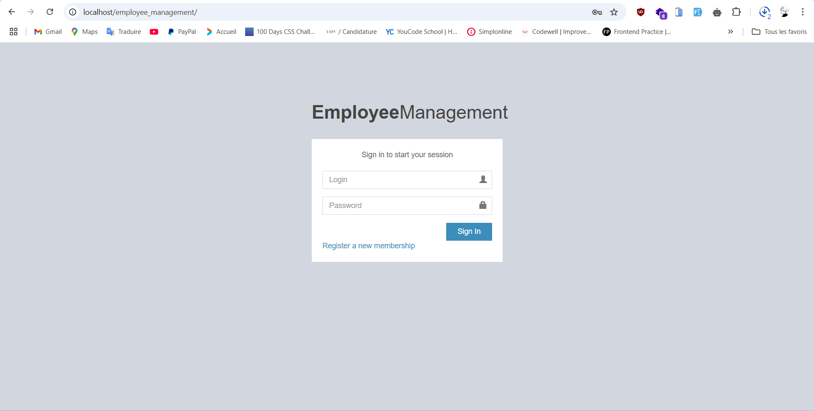
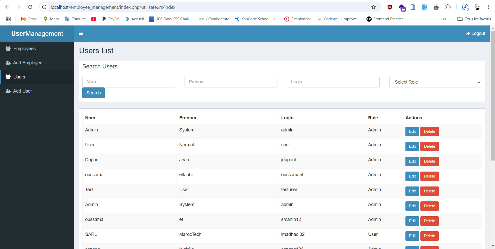
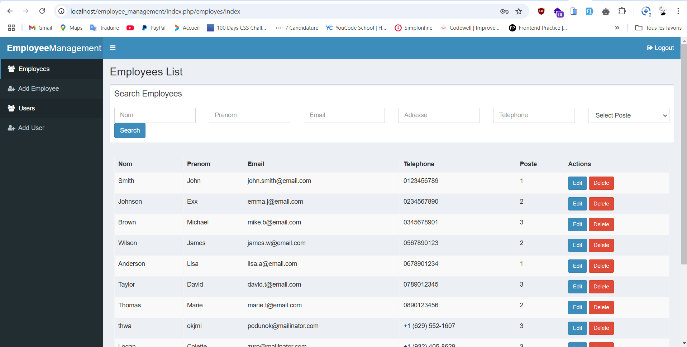

# Système de Gestion des Employés

## Aperçu du Projet
Cette application web est conçue pour la gestion et le stockage des dossiers des employés. L'application est construite en utilisant l'architecture MVC et comprend trois modules principaux :

1. **Gestion des Utilisateurs** : Les administrateurs peuvent créer et gérer des utilisateurs (admins ou utilisateurs normaux).
2. **Authentification** : Les utilisateurs peuvent se connecter avec leurs identifiants, et l'accès est basé sur les rôles.
3. **Gestion des Employés** : Un annuaire des employés avec des opérations CRUD complètes.

---

## Fonctionnalités

### Module de Gestion des Utilisateurs
- Ajouter, modifier, supprimer des utilisateurs.
- Rechercher des utilisateurs par :
  - Nom
  - Login
  - Rôle (Admin/Utilisateur).
- Accès basé sur les rôles :
  - Seuls les Admins peuvent gérer les utilisateurs.
  - Les utilisateurs ne peuvent pas accéder à ce module.

### Module d'Authentification
- Fonctionnalités de connexion et de déconnexion.
- Redirection du tableau de bord en fonction du rôle.
- Validation des identifiants incorrects.

### Module de Gestion des Employés
- Ajouter, modifier, supprimer des employés.
- Rechercher des employés par :
  - Nom
  - Email
  - Adresse
  - Numéro de téléphone.
- Postes des employés :
  - Gérant
  - Livreur
  - Cuisinier.

---

## Technologies Utilisées

### Frontend
- **HTML5**
- **CSS** (utilisant [AdminLTE 2](https://adminlte.io/))
- **jQuery**
- **Bootstrap**

### Backend
- **PHP 7** (utilisant [CodeIgniter 3](https://codeigniter.com/))
- **MySQL** (pour la gestion de la base de données)

---

## Installation et Configuration

### Prérequis
- PHP 7.x
- Serveur MySQL
- Environnement serveur local (ex. XAMPP, WAMP ou LAMP).

### Étapes d'Installation

1. Cloner le dépôt ou extraire le fichier `.zip` fourni.
   ```bash
   git clone <repository_url>
   ```
2. Importer la base de données :
   - Ouvrir votre outil de gestion de base de données (ex. phpMyAdmin).
   - Créer une nouvelle base de données (ex. `employee_management`).
   - Importer le fichier `create_tables_sql.sql` dans la base de données.

3. Configurer la connexion à la base de données :
   - Ouvrir `application/config/database.php`.
   - Mettre à jour les informations avec vos identifiants de base de données :
     ```php
     'hostname' => 'localhost',
     'username' => 'votre_utilisateur_bdd',
     'password' => 'votre_mot_de_passe_bdd',
     'database' => 'employee_management',
     ```

4. Exécuter l'application :
   - Placer le dossier du projet dans le répertoire `htdocs` (pour XAMPP) ou dans le répertoire racine de votre serveur.
   - Démarrer votre serveur et visiter :
     ```
     http://localhost/<project_folder>/
     ```

---

## Identifiants par Défaut

### Compte Admin :
- **Login** : `admin`
- **Mot de passe** : `admin_password_hash`

### Compte Utilisateur :
- **Login** : `johndoe`
- **Mot de passe** : `user_password_hash`

---

## Structure du Projet
```
├── application
│   ├── config
│   ├── controllers
│   ├── models
│   ├── views
├── assets
│   ├── css
│   ├── js
│   ├── img
└── create_tables_sql.sql
```

- **`application`** : Contient les fichiers principaux de CodeIgniter pour les contrôleurs, modèles et vues.
- **`assets`** : Contient les fichiers statiques comme CSS, JS et images.
- **`create_tables_sql.sql`** : Fichier SQL pour la configuration de la base de données.

---

## Captures d'Écran

### Page de Connexion


### Gestion des Utilisateurs


### Gestion des Employés


---

## Auteur
Développé par **Imad Hadi**. Pour toute question ou assistance, n'hésitez pas à me contacter :
- **Email** : [imadhadi02@gmail.com](mailto:imadhadi02@gmail.com)
- **Téléphone** : 0625171880

---

## Licence
Ce projet est à des fins éducatives et n'est pas sous licence pour une utilisation commerciale.
